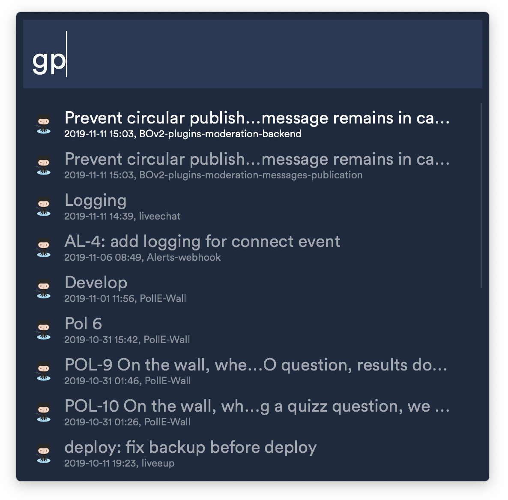

# Show open Github Pull Requests

  

### Usage

1. Set the following environment variables:

- GITHUB_ORGANIZATION
- GITHUB_TOKEN: [use this link to generate a new token](https://github.com/settings/tokens/new), you only need the repo permissions

You should be prompted to fill them when installing the workflow. If not, you can check how to do it on [Alfred documentation](https://www.alfredapp.com/help/workflows/advanced/variables/#environment).

2. Use the `gp` command inside Alfred to see the open pull requests of your organization.
